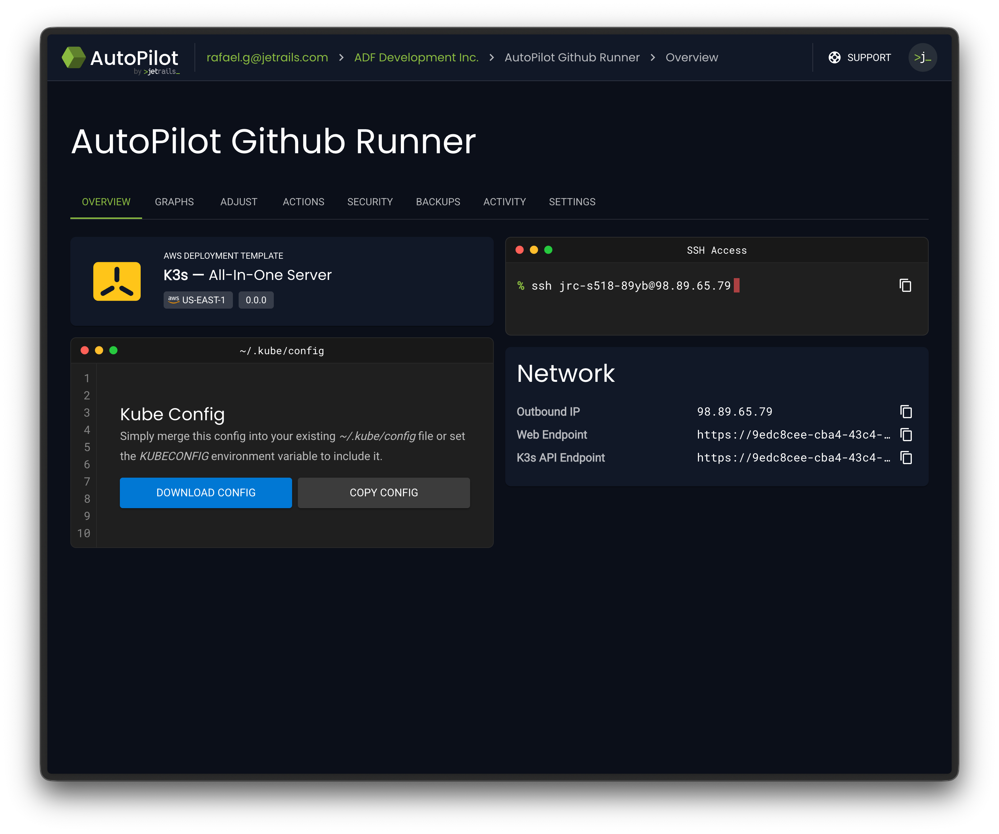
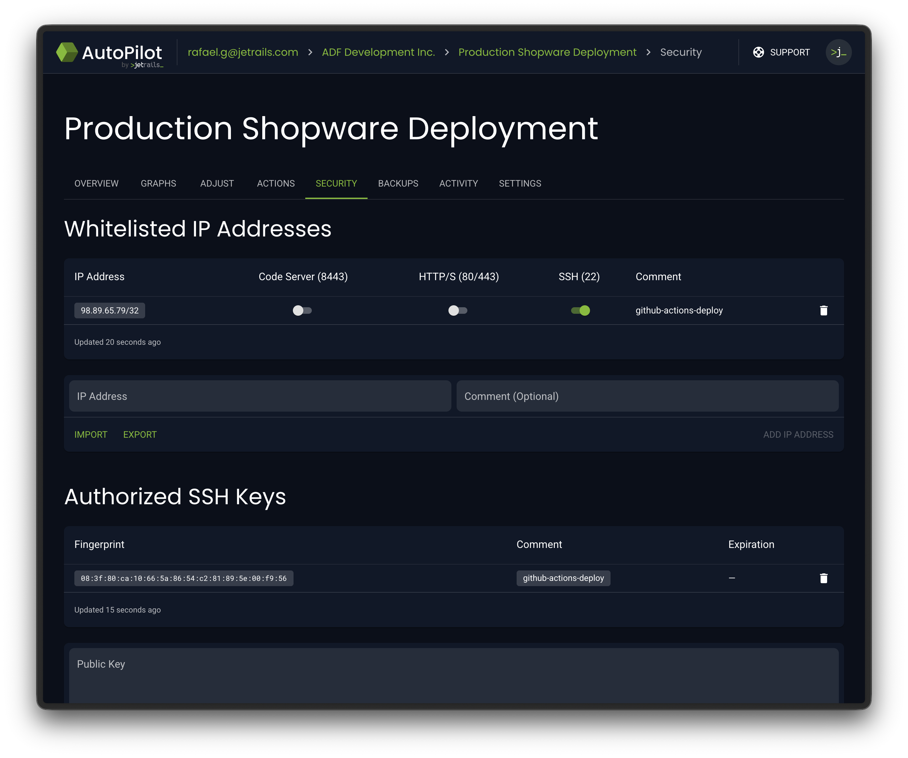
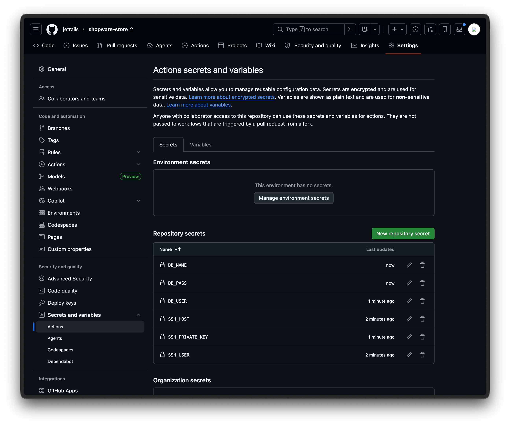
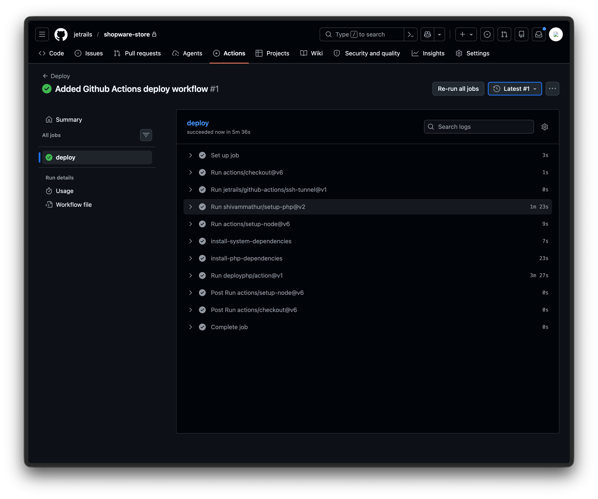

This guide takes you from having no deployment pipeline to a fully automated GitOps workflow for your Shopware store on JetRails AutoPilot.
Using Deployer PHP and GitHub Actions, we will set up a pipeline where pushing to your `master` branch automatically builds and deploys your Shopware store to production.
This guide assumes you have a Shopware deployment on JetRails [AutoPilot](https://autopilot.jetrails.com) and a [GitHub](https://github.com) repository containing your Shopware project.

!!! Assumption:
We assume the store's domain name is `example.com` and the default branch is `master`.
!!!

## Dedicated GitHub Action Runner

GitHub's hosted runners use a large and frequently changing pool of IP addresses, making it impractical to whitelist them all.
The recommended approach is to use a self-hosted runner whose outbound IP address you control.
If you are using the JetRails AutoPilot K3s template, you can set up a self-hosted runner using [Actions Runner Controller (ARC)](https://github.com/actions/actions-runner-controller) by following the [Self-Hosted GitHub Action Runners](/guides/self-hosted-github-action-runners/) guide.

The rest of this guide assumes you have a self-hosted runner named `autopilot-github-runner` ready to accept workflow jobs.

## Install AutoPilot Recipe

In your Shopware project's repository, install the [jetrails/deployer-autopilot](https://github.com/jetrails/deployer-autopilot) deployer recipe using Composer.

```shell
composer require jetrails/deployer-autopilot
```

This will update your `composer.json` and `composer.lock` files. You should commit these changes to your Github repository.

## Create SSH Key Pair

Generate a dedicated SSH key pair for the deployment pipeline.
This key will be used in your Github Action's workflow to connect to your Shopware deployment on AutoPilot:

```shell
ssh-keygen -t ed25519 -f ./deploy_key -N "" -C "github-actions-deploy"
```

This creates 2 files in the current directory.
The public key is `deploy_key.pub` and the private key is `deploy_key`.

!!!warning Warning
Do not accidentally commit these files to your repository.
!!!

## Whitelist & Authorize Connection

We will have to whitelist the outbound IP address of your self-hosted runner as well as authorize the SSH key (that we just made) on your Shopware deployment.

First start by going to the **Overview** tab of your K3s deployment in AutoPilot.
There you will find the **Outbound IP** address of your self-hosted runner in the **Network** card.



Take note of this IP address and head to the **Security** tab in your Shopware deployment in AutoPilot.
Once there, you can whitelist the outbound IP address of your self-hosted runner and whitelist the SSH port for that IP address.
While you are there, also whitelist the SSH key using the contents of the `deploy_key.pub` file.



## Setup Github Repository Secrets

Next, create the following **Repository secrets** in your Github repository under **Settings** > **Secrets and variables** > **Actions**:

| Name              | Description |
| ----------------- | ----------- |
| `SSH_USER`        | The cluster user of your Shopware deployment on AutoPilot |
| `SSH_HOST`        | The elastic IP address of your Shopware deployment on AutoPilot |
| `SSH_PRIVATE_KEY` | The private SSH key that we generated (`deploy_key`) |

Additionally, we will set credentials to setup a database connection since the default Shopware recipe requires it.
You can find these values in the **Database** card on the **Overview** tab of your Shopware deployment in the AutoPilot dashboard.

| Name      | Description |
| --------- | ----------- |
| `DB_USER` | The database user for your Shopware deployment on AutoPilot |
| `DB_PASS` | The database password for your Shopware deployment on AutoPilot |
| `DB_NAME` | The database name for your Shopware deployment on AutoPilot |



## Customize Deployer File

You can find an example deploy.php file [here](https://github.com/jetrails/deployer-autopilot/blob/master/examples/shopware.php).
Put this file in the root of your repository and customize it to fit your Shopware deployment.

Out of the box, you should only need to change the `primary_domain` to match your store's domain.
The `cluster_user` and `elastic_ip` values are read from environment variables that our workflow will pass to Deployer:

```php
set("primary_domain", "example.com");
set("cluster_user", getenv("SSH_USER"));
set("elastic_ip", getenv("SSH_HOST"));
```

Once you have customized the deploy.php file, you can commit it to your repository.

## Create Github Actions Workflow

Create a file at this path relative to your repository: `.github/workflows/deploy.yml`.
Put the following contents in this file:

```yaml
name: Deploy

on:
  push:
    branches:
      - master

jobs:
  deploy:
    runs-on: autopilot-github-runner
    steps:
      - uses: actions/checkout@v6

      - uses: jetrails/github-actions/ssh-tunnel@v1
        with:
          ssh-user: ${{ secrets.SSH_USER }}
          ssh-host: ${{ secrets.SSH_HOST }}
          ssh-private-key: ${{ secrets.SSH_PRIVATE_KEY }}
          source-port: "3306"
          target-port: "3306"
          target-host: database.internal

      - uses: shivammathur/setup-php@v2
        with:
          php-version: '8.4'
          tools: composer

      - uses: actions/setup-node@v6
        with:
          node-version: '22'

      - name: install-system-dependencies
        run: sudo apt-get update && sudo apt-get install -y rsync

      - name: install-php-dependencies
        run: composer install --no-interaction --prefer-dist --no-dev

      - uses: deployphp/action@v1
        env:
          SSH_USER: ${{ secrets.SSH_USER }}
          SSH_HOST: ${{ secrets.SSH_HOST }}
          DATABASE_URL: mysql://${{ secrets.DB_USER }}:${{ secrets.DB_PASS }}@127.0.0.1/${{ secrets.DB_NAME }}
        with:
          dep: deploy
          private-key: ${{ secrets.SSH_PRIVATE_KEY }}
```

Here is a breakdown of what each step does:

- Clones your repository onto the runner
- Opens an SSH tunnel to your database, making it accessible at `127.0.0.1:3306` for theme compilation
- Installs PHP and Composer (customize `php-version` to match your deployment)
- Installs Node.js (customize `node-version` to match your deployment)
- Installs `rsync`, which Deployer uses to upload files to the server (default code update strategy)
- Installs production PHP dependencies via Composer
- Runs Deployer using the official [deployphp/action](https://github.com/deployphp/action) with a `DATABASE_URL` pointing to the tunneled connection

Once you commit this file and push to the `master` branch, the workflow will run automatically.

## Verify Workflow Run

Once the workflow runs, you can monitor its progress under the **Actions** tab in your GitHub repository.
Click into the run to see the details of each step.
A successful run will show all steps completed with a checkmark.



## Possible Optimizations

If you want your workflow runs to execute faster, consider creating a custom runner image that already has PHP, Node.js, Composer, and rsync pre-installed.
This way, you can skip the setup steps and go straight to installing dependencies and deploying.
