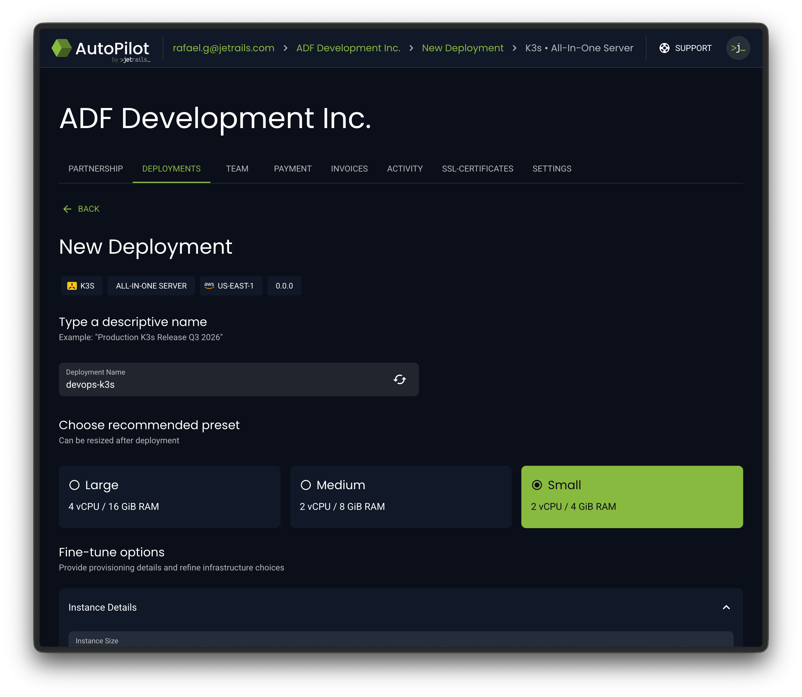
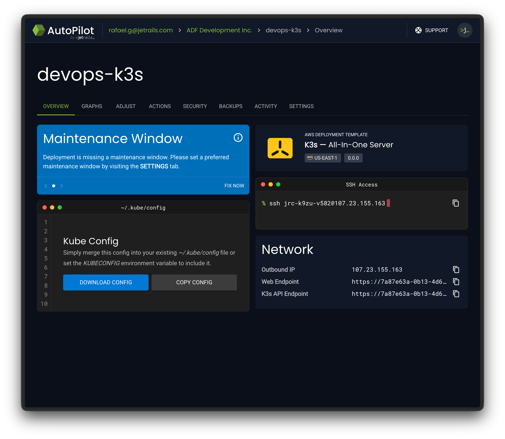
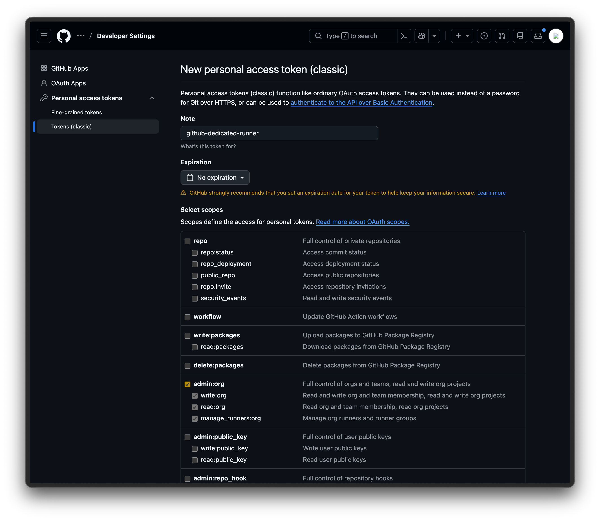
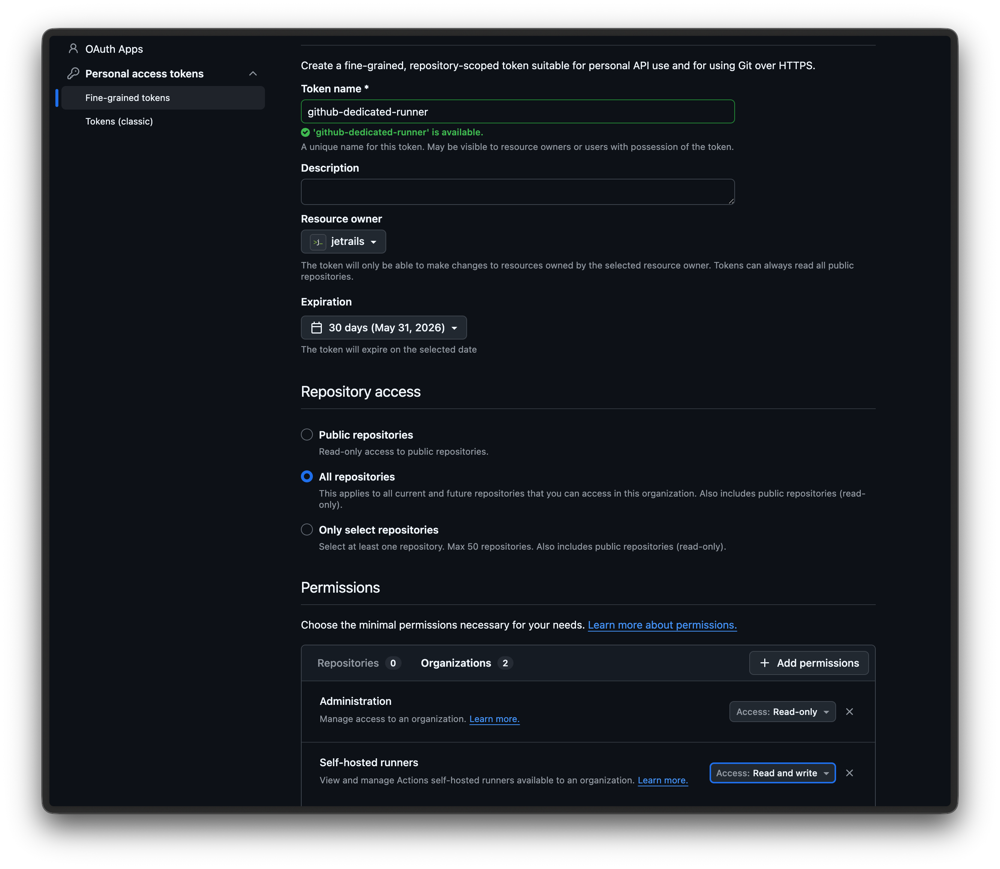
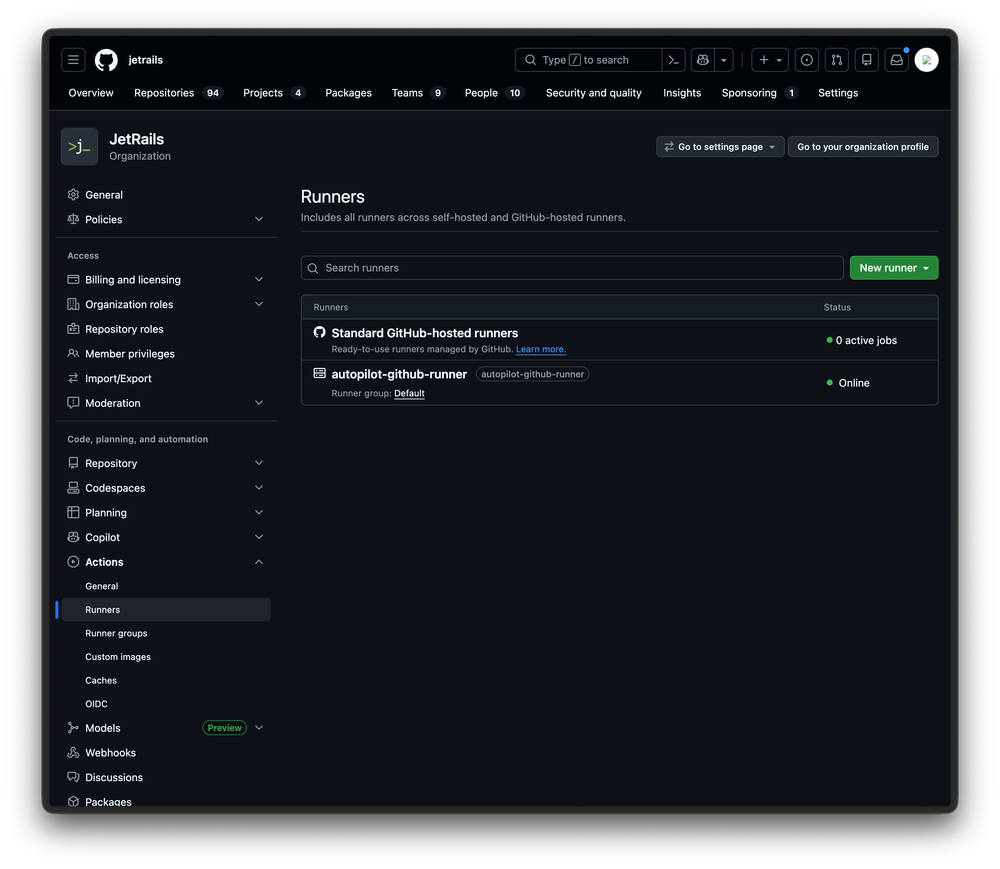
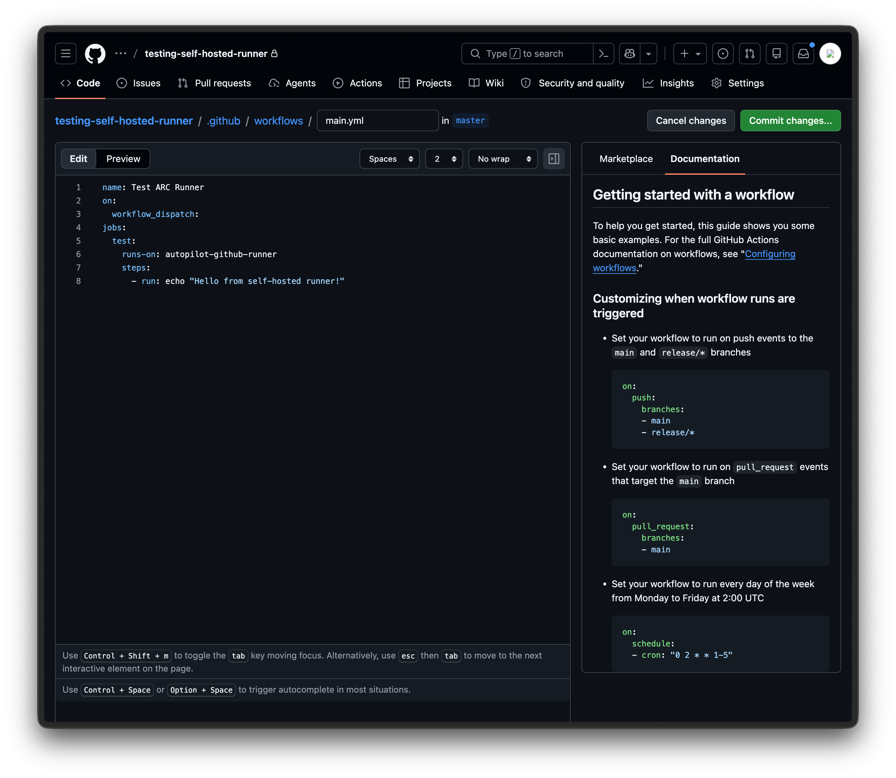
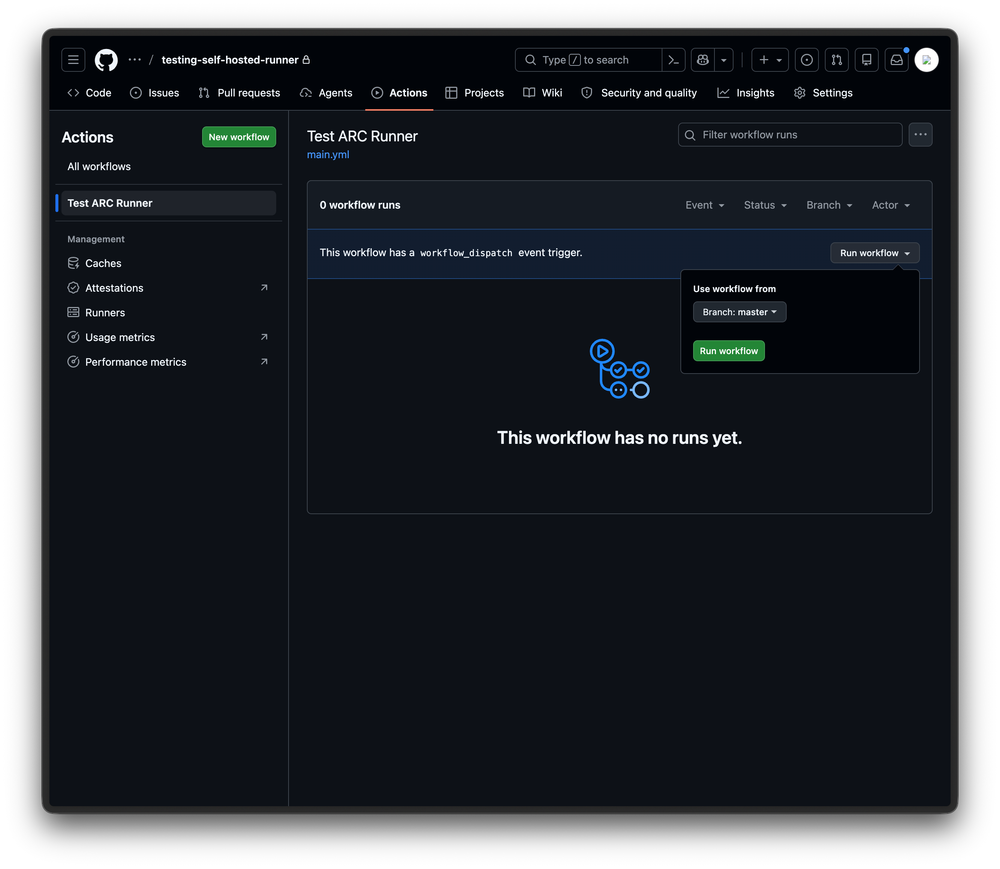
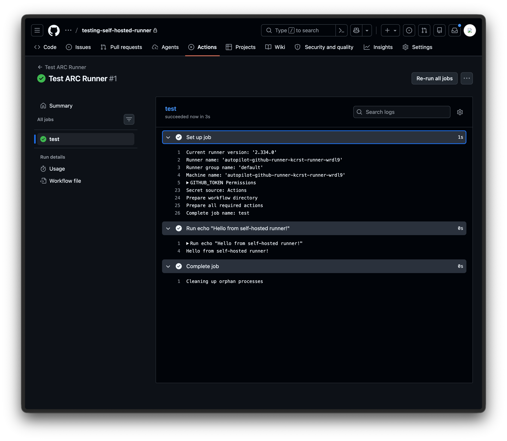

This guide walks you through setting up self-hosted GitHub Action runners using **Actions Runner Controller (ARC)** on a K3s server deployed through JetRails AutoPilot.
ARC is the **officially supported** method by GitHub for orchestrating self-hosted runners on Kubernetes.
Runners initiate outbound connections to GitHub, so there's no need to whitelist GitHub's IP ranges.

For more details, see GitHub's official documentation on [authenticating ARC to the GitHub API](https://docs.github.com/en/actions/how-tos/manage-runners/use-actions-runner-controller/authenticate-to-the-api).

## Prerequisites

- A JetRails [AutoPilot](https://autopilot.jetrails.com) account
- A [GitHub](https://github.com) account with permission to create tokens
- [helm](https://helm.sh/docs/intro/install/) installed on your local machine
- [kubectl](https://kubernetes.io/docs/tasks/tools/) installed on your local machine

## Create AutoPilot Deployment

AutoPilot comes with a **K3s AIO (All-In-One) template**.
We'll use this to spin up our Kubernetes server.

1. Log into JetRails AutoPilot.
2. Navigate to the deployment creation page.
3. Select the **K3s All-In-One Server** template.
4. Configure your desired instance size, then launch the deployment.



## Configure Access

Once the deployment is fully provisioned, you'll need to download the kube config file and whitelist your IP to interact with the K3s API.

1. Navigate to the **Overview** page of your K3s deployment in AutoPilot.
2. Wait until the status shows that the deployment is fully ready before proceeding.
3. Download the **Kube Config** file from the overview page.
4. Install or merge the downloaded config file on your local machine.
5. Go to the **Security** tab and add your current connection's IP address to the whitelist.

!!!
If you do not have a `~/.kube/config` file, you can simply put the downloaded kube config file there. If you would like to temporarily use this k3s deployment as your default, you can also set the `KUBECONFIG` environment variable to point to the kube config file you just downloaded.
!!!



You can now verify access to the K3s API endpoint. The K3s node should be listed and in the **Ready** state:

```shell
$ kubectl get nodes

NAME                  STATUS   ROLES           AGE   VERSION
i-0aa466dbe7563658d   Ready    control-plane   80m   v1.35.4+k3s1

```

## Create a GitHub PAT

ARC needs to authenticate with GitHub to register runners.
You can use either a **GitHub App** or a **Personal Access Token (PAT)**.
For simplicity, we'll use a PAT in this guide and register a runner at the organization level.
You can choose to create either a **classic** or **fine-grained** token:

+++ Tokens (classic)
1. Log in to GitHub and go to https://github.com/settings/tokens.
2. Click on **Generate new token** and choose the **Generate new token (classic)** option.
3. Give it a descriptive name (e.g., `github-dedicated-runner`).
4. Give it an expiration date you are comfortable with.
5. Choose the `admin:org` permission.
6. Generate the token and copy it for future use.



+++ Fine-grained tokens
1. Log in to GitHub and go to https://github.com/settings/personal-access-tokens.
2. Click on the **Generate new token** button.
3. Give it a descriptive name (e.g., `github-dedicated-runner`).
4. Under **Resource owner**, select the organization you want to register the runner for.
5. Give it an expiration date you are comfortable with.
6. Under the **Repository access** section, select whatever option suits your needs.
7. Under the **Permissions** > **Organizations** section, select the `Administration` permission with `Read-only` access.
8. Under the **Permissions** > **Organizations** section, select the `Self-hosted runners` permission with `Read and write` access.
9. Generate the token and copy it for future use.



+++

## Install ARC

Install the ARC controller using GitHub's official Helm chart.
This deploys the controller that manages the lifecycle of runner pods.

```shell
helm install arc \
  --namespace arc-systems \
  --create-namespace \
  oci://ghcr.io/actions/actions-runner-controller-charts/gha-runner-scale-set-controller
```

## Install the Runner Scale Set

Now install a runner scale set that connects to your GitHub organization or repository.
This is what actually registers runners with GitHub and scales them based on demand.

!!!
The name of the Helm release is important.
It will also be used as the runner label you reference in your workflow files and your dedicated runner's name in the GitHub UI.
In our example, we'll use `autopilot-github-runner`.
!!!

```shell
GITHUB_CONFIG_URL="https://github.com/<org-name>"
GITHUB_PAT="<pat-token>"

helm install autopilot-github-runner \
  --namespace arc-runners \
  --create-namespace \
  --set githubConfigUrl="${GITHUB_CONFIG_URL}" \
  --set githubConfigSecret.github_token="${GITHUB_PAT}" \
  oci://ghcr.io/actions/actions-runner-controller-charts/gha-runner-scale-set
```

At this point, you are all done with the installation. Your runner should automatically be registered with GitHub and start picking up workflow jobs.

## Verify Installation

Once installed, you can confirm that the runner registered successfully by navigating to your organization's **Settings > Actions > Runners** page on GitHub.
You should see your runner listed with an **Online** status.



To test that jobs are being routed correctly, create a new repository on GitHub and add the file `.github/workflows/main.yml` with the following content:

```yaml #6
name: Test ARC Runner
on:
  workflow_dispatch:
jobs:
  test:
    runs-on: autopilot-github-runner
    steps:
      - run: echo "Hello from self-hosted runner!"
```

The `runs-on` value must match the Helm release name from the previous step.
The `workflow_dispatch` trigger lets you run the workflow manually from the GitHub UI, which is useful for testing.



Once the file is committed, go to the **Actions** tab in your repository, select the **Test ARC Runner** workflow, and click **Run workflow**.



You should see the workflow run successfully with the expected output.



